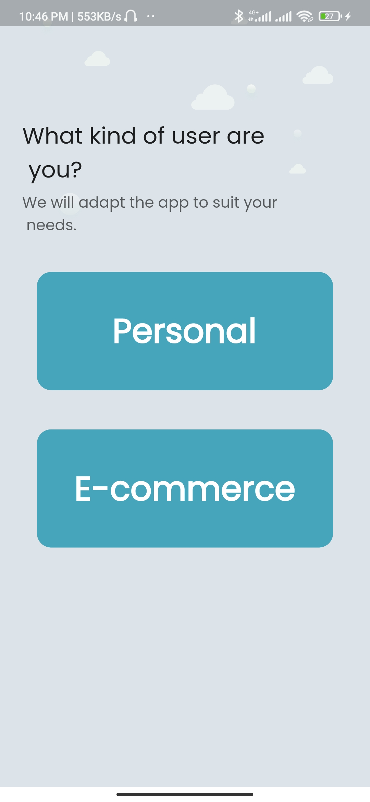
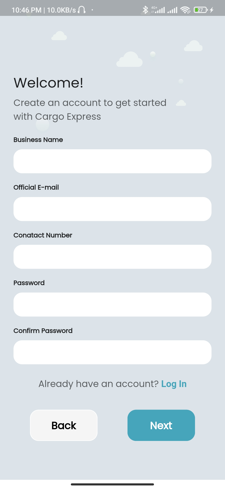
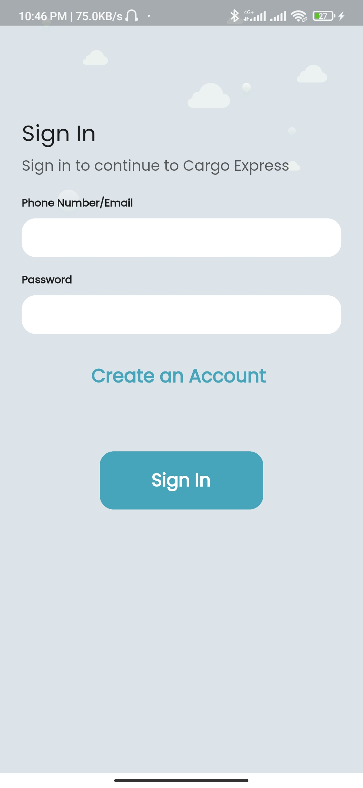
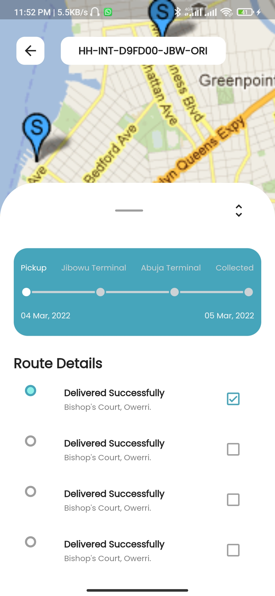
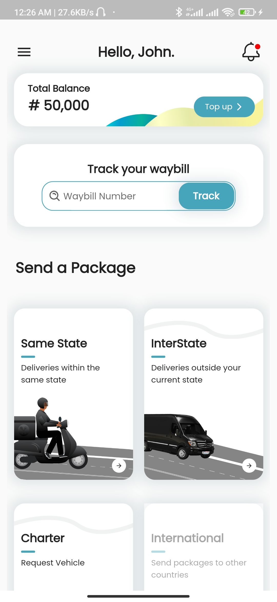

# mobile_assessment_flutter

A design according to a figma mobile app prototype.
figma link: https://www.figma.com/proto/5LY5cbzsCwJcYEt592DLwc/FUSION-INTELLIGENCE---MOBILE-DEV-CANDIDATE-SCREEN?page-id=0%3A1&node-id=2%3A7&viewport=621%2C361%2C0.47&scaling=scale-down&starting-point-node-id=2%3A5

## Getting Started

This project is a starting point for a Flutter application.

A few resources to get you started if this is your first Flutter project:

- [Lab: Write your first Flutter app](https://flutter.dev/docs/get-started/codelab)
- [Cookbook: Useful Flutter samples](https://flutter.dev/docs/cookbook)

For help getting started with Flutter, view our
[online documentation](https://flutter.dev/docs), which offers tutorials,
samples, guidance on mobile development, and a full API reference.

